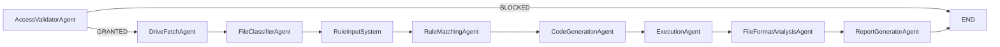

# drive-validation

## LangGraph-Based Agentic Validation System

Production-oriented multi-agent dataset validation platform using LangGraph, FastAPI, and Streamlit.

## Architecture

Pipeline uses 9 specialized agents in a linear graph:

1. `AccessValidatorAgent`
2. `DriveFetchAgent`
3. `FileClassifierAgent`
4. `RuleInputSystem`
5. `RuleMatchingAgent`
6. `CodeGenerationAgent`
7. `ExecutionAgent`
8. `FileFormatAnalysisAgent`
9. `ReportGeneratorAgent`

Conditional halt is applied after Agent 1 when access is blocked.



## Tech Stack

- Python 3.11+
- LangGraph + LangChain
- FastAPI
- Streamlit
- gdown + requests (Drive download/access)
- numpy + torch
- reportlab (PDF)
- orjson

## API Endpoints

- `POST /validate`
  - Input:
    - `drive_url` (string)
    - `rule_sets` (`{ "A": ["rule1", "rule2"] }`)
    - `llm_provider` (`openai|anthropic|gemini`)
    - `llm_model` (string)
- `GET /status/{job_id}`
- `GET /report/{job_id}?format=json|pdf`

## Environment Variables

- `OPENAI_API_KEY`
- `ANTHROPIC_API_KEY`
- `GOOGLE_API_KEY`
- `RATE_LIMIT_PER_MIN` (default: `30`)
- `VALIDATION_JOBS_DIR` (default: `/tmp/staging/jobs`)

## Setup

```bash
python -m venv .venv
source .venv/bin/activate
pip install -r requirements.txt
uvicorn app.main:app --reload
```

Run UI:

```bash
streamlit run ui/streamlit_app.py
```

## Docker

```bash
docker compose up --build
```

## State Schema

Implemented in `app/models.py` as `ValidationState` typed dict:

- `drive_url`
- `access_status`
- `downloaded_files`
- `rule_sets`
- `file_rule_mapping`
- `generated_validators`
- `execution_results`
- `format_analysis`
- `final_report`
- `errors`
- `current_agent`
- `pipeline_status`

## Security Controls

- Google Drive URL sanitization and host validation
- Restricted generated-code screening via AST checks
- File extension whitelisting
- No hardcoded credentials (env-var only)
- API rate limiting middleware
- Structured JSON logs and persistent job event logs

## Scalability Notes

- Parallel file validation with `ThreadPoolExecutor`
- Memory-safe handling via streaming for line-based files
- Stateless agent execution through graph state
- Job status/report persisted to filesystem to support multi-replica API patterns

## Tests

```bash
pytest -q
```

Includes agent-level unit tests with mocks for network/LLM dependent nodes.
